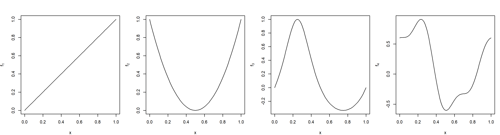

```{r setup, include=FALSE}
knitr::opts_chunk$set(echo = FALSE, warning = FALSE, message = FALSE)
library(plotly)
library(ggplot2)
library(palmerpenguins)
library(kableExtra)
```

# Introduction {#sec1}

With the rapid development of data collection technology, the amount and complexity of data in many fields have increased exponentially. In high-dimensional data which is the number of predictors $d$ exceeds the number of observations $n$, one of the goals of statistical modeling is to identify complex relationships between response and explanatory variables. One simple approach to achieve this goal is linear regression, but it does not easily provide well-defined coefficient estimates [@Montgomery:2021]. In high-dimensional data, model selection is essential because in many cases there are only a few variables that affect predictive performance. Statistical variable selection methods such as forward selection, backward elimination, and stepwise procedures are basic approaches, while regularization methods such as LASSO [@Tibshirani:1996], ridge [@Hoerl:1970], SCAD [@Fan:2001], and elastic-net [@Zou:2005] are also widely used.

Unfortunately, the expectation that explanatory variables linearly explain the response variable is often unrealistic. Nonparametric models are good alternative because they allow nonlinear relationships and are more flexible than parametric models. Several widely used nonparametric models, such as CART [@Breiman:1984], MARS [@Friedman:1991], BRUTO [@Hastie:1989], and TURBO [@Friedman:1989], employ greedy algorithms to find local optima, similar to the forward selection and backward elimination of linear regression.

Smoothing spline ANOVA (SS-ANOVA) is a widely used method for multivariate function estimation [@Wahba:1990, Gu:2013]. Recently, @Lin:2006 proposed the COmponent Selection and Smoothing Operator (COSSO), a nonparametric regression model that performs model selection and estimation simultaneously, and is applied in various fields [@Kavuri:2017, Dempsey:2017]. COSSO introduces a new LASSO-type penalty that consists of the sum of the norms of the components. The COSSO penalty is computationally useful for high-dimensional data because the ANOVA decomposition approximates high dimensions as a sum of low dimensions. This penalty estimates a sparse component similar to LASSO, which is a global optimum. @Lin:2006 showed that LASSO is a special case of the COSSO penalty. After @Lin:2006 introduced COSSO for Gaussian regression, @Zhang:2006 and @Leng:2006 extended it to the exponential family and the Cox proportional hazards (CoxPH) model, respectively. 

In this paper, we introduce \pkg{cossonet} which is an integrated R package for fast sparse nonparametric regression for high-dimensional data. \pkg{cossonet} is a function integrating models of @Zhang:2006, @Lin:2006, and @Leng:2006. \pkg{cossonet} provides three key contributions. First, the standard LASSO-type penalty is extended to an elastic-net type to select correlated components. Second, \pkg{cossonet} aims to achieve fast computation for $n$ and $d$. The existing studies derived algorithms to solve the inverse matrix for $n$ and $d$. To reduce the computational burden for large $n$, they used an alternative algorithm based on subset of $m < n$. \pkg{cossonet} is implemented as a coordinate descent algorithm under the subset-based algorithm for fast computations for both large $n$ and $d$. Finally, \pkg{cossonet} can deal with a various response types including continuous, binary classes, non-negative counts, and survival. A comparison for the R package \pkg{cossonet} and \CRANpkg{cosso} can be seen in Table `r knitr::asis_output(ifelse(knitr::is_html_output(), '\\@ref(tab:tab-comp-html)', '\\@ref(tab:tab-comp-latex)'))`.

This paper is organized as follows. Section `\\@ref(sec2)` provides an introduction to the SS-ANOVA framework, which serves as the foundation for the COSSO model, and defines COSSO with elastic-net penalty for the exponential family and CoxPH models. In Section \@(sec3), coordinate descent algorithms are derived for the regression models, along with a description of smoothing spline selection via cross-validation. Section \@ref(sec4) presents the usage of the \pkg{cossonet} package and analyzes simulation results obtained with \pkg{cossonet}. Real data analysis and discussion of the results are included in Section \@ref(sec5). Finally, Section \@ref(sec6) provides the conclusion of the paper. 

```{r tab-comp-html, eval = knitr::is_html_output(), layout = "l-body-outset"}
library(knitr)

table_data_html <- data.frame(
  Response_Type = c("Gaussian", "Binomial", "Poisson", "Cox"),
  cossonet = c("$\\checkmark$", "$\\checkmark$", "$\\checkmark$", "$\\checkmark$"),
  cosso = c("$\\checkmark", "$\\checkmark$", "$\\times$", "$\\checkmark$"),
  LASSO = c("$\\checkmark", "$\\checkmark$", "$\\times$", "$\\checkmark$"),
  Ridge = c("$\\checkmark", "$\\checkmark$", "$\\times$", "$\\checkmark$"),
  Elastic_net = c("$\\checkmark$", "$\\checkmark$", "$\\times$", "$\\checkmark$"),
  main_effect = c("$\\checkmark$", "$\\checkmark$", "$\\checkmark$", "$\\checkmark$"),
  two_way_interaction = c("$\\checkmark$", "$\\times$", "$\\checkmark$", "$\\times$")
)

names(table_data_html) <- gsub("_", " ", names(table_data_html))

knitr::kable(table_data_html, format = "html", caption = "Comparison of the key capabilities of the cossonet and cosso packages.", align = "c")
```

```{r tab-comp-latex, eval = knitr::is_latex_output()}
library(knitr)
table_data_latex <- data.frame(
  Response_Type = c("Gaussian", "Binomial", "Poisson", "Cox"),
  cossonet = c("$\\checkmark$", "$\\checkmark$", "$\\checkmark$", "$\\checkmark$"),
  cosso = c("$\\checkmark", "$\\checkmark$", "$\\times$", "$\\checkmark$"),
  LASSO = c("$\\checkmark", "$\\checkmark$", "$\\times$", "$\\checkmark$"),
  Ridge = c("$\\checkmark", "$\\checkmark$", "$\\times$", "$\\checkmark$"),
  Elastic_net = c("$\\checkmark$", "$\\checkmark$", "$\\times$", "$\\checkmark$"),
  main_effect = c("$\\checkmark$", "$\\checkmark$", "$\\checkmark$", "$\\checkmark$"),
  two_way_interaction = c("$\\checkmark$", "$\\times$", "$\\checkmark$", "$\\times$")
)

names(table_data_latex) <- gsub("_", " ", names(table_data_latex))

knitr::kable(table_data_latex, format = "latex", caption = "Comparison of the key capabilities of the cossonet and cosso packages.") %>% 
  kableExtra::kable_styling()
```

# Model {#sec2}

## Smoothing Spline ANOVA {#ssec2_1}
The functional ANOVA decomposition expresses a multivariate function $f$ as a sum of components, capturing different levels of interactions among the explanatory variables. For explanatory variables $x = (x^{(1)}, \dots, x^{(d)}) \in \mathcal{X} = [0, 1]^d$, the decomposition is represented as 
\begin{align}
	f(x) = f_0 + \sum_{j=1}^{d} f_j(x^{(j)}) + \sum_{j < k} f_{jk}(x^{(j)}, x^{(k)}) + \cdots + f_{1, \dots, d}(x^{(1)}, \dots, x^{(d)}),
	(\#eq:decom) 
\end{align}
where $f_0$ is a constant term, $f_j$'s are the main effects, and $f_{jk}$'s are two-way interactions, and so on. The identifiability of the terms in equation \@ref(eq:decom) is ensured by certain side conditions. To simplify the model, SS-ANOVA typically considers only lower-order interactions, such as main effects and two-way interactions.

Each main effect $f_j(x^{(j)})$ belongs to a reproducing kernel Hilbert space (RKHS) $\mathcal{H}^{(j)}$ which is decomposed as
\begin{align}
	\mathcal{H}^{(j)} = \mathcal{H}_0^{(j)} \oplus \mathcal{H}_1^{(j)},
	(\#eq:space) 
\end{align}
where $\mathcal{H}_0^{(j)}$ is the mean space and $\mathcal{H}_1^{(j)}$ is the contrast space. If $x^{(j)}$ is continuous, $\mathcal{H}^{(j)}$ is often considered as the second-order Sobolev Hilbert space
\begin{align*}
	W_2[0,1] = \{ g : g \text{ and } g' \text{ are absolutely continuous, and } g'' \in \mathcal{L}_2[0,1] \}.
\end{align*}
The inner product with respect to $W_2[0,1]$ is defined as
\begin{align*}
	<f,g> = \left[ \int_{0}^{1} g(t) \, dt \right]^2 + \left[ \int_{0}^{1} g'(t) \, dt \right]^2 + \int_{0}^{1} [g''(t)]^2 \, dt,
\end{align*}
and the corresponding reproducing kernel is
\begin{align*}
	K(s,t) = 1 + k_1(s) k_1(t) + k_2(s) k_2(t) - k_4(|s-t|),
\end{align*}
where $k_1(s) = s - 1/2$, $k_2(s) = (k_1^2(s) - 1/12)/2$, and $k_4(t) = (k_1^4(t) - k_1^2(t)/2 + 7/240)/24$. For derivation of the reproducing kernel for the continuous variable, see Chapter 2.3 of @Gu:2013.
Suppose that categorical variables $x^{(j)}$ is taken $L$ distinct values from the set $\{1, \dots ,L\}$ and $f_j(x^{(j)})$ is represented as an $L$-vector. The space $\mathcal{H}_0^{(j)}$ is defined as $\{f : f(1) = \cdots = f(L)\}$ and $\mathcal{H}_1^{(j)}$ is defined as $\{f : f(1) + \cdots + f(L) = 0\}$. The reproducing kernel for $\mathcal{H}_1^{(j)}$ in equation \@ref(eq:space) is
\begin{align*}
	K_1(s,t) = L \cdot I(s = t) - 1,
\end{align*}
where $I(\cdot)$ is the indicator function. For the derivation of the reproducing kernel for the category variable, see Chapter 2.2 of @Gu:2013.

The full space corresponding to the decomposition \@ref(eq:decom) is expressed as a tensor product
\begin{align}
	\otimes_{j=1}^{d} \mathcal{H}^{(j)} = \{1\} \oplus 
	\left[ \oplus_{j=1}^{d} \mathcal{H}_1^{(j)} \right] \oplus \left[ \oplus_{j<k} \mathcal{H}_1^{(j)} \otimes \mathcal{H}_1^{(k)} \right] \oplus \cdots.
	(\#eq:tensor) 
\end{align}
If $x^{(j)}$ is continuous, the reproducing kernel of the tensor product space $\mathcal{H}^{(j)} \otimes \mathcal{H}^{(k)}$ is the product of $K(s^{(j)},t^{(j)})$ and $K(s^{(k)},t^{(k)})$. If $x^{(j)}$ is categorical, the reproducing kernel is then the product of  $K_1(s^{(j)},t^{(j)})$ and $K_1(s^{(k)},t^{(k)})$. Thus, the full space $\mathcal{F}$ corresponding to equation \@ref(eq:tensor) is
\begin{align}
	\mathcal{F} = \{1\} \oplus_{v=1}^{p} \mathcal{F}^{(v)},
	(\#eq:full-decom) 
\end{align} 
where $\mathcal{F}^{(1)}, \dots, \mathcal{F}^{(p)}$ are $p$ orthogonal subspaces of $\mathcal{F}$. For the main effects model, $p = d$ and each $\mathcal{F}^{(v)}$ corresponds to a subspace of the main effects. This case is equivalent to an additive model. For the two-way interactions model, $p = d(d+1)/2$ and $\mathcal{F}^{(v)}$ include subspaces of the main effects and the two-way interactions.

## COSSO penalized likelihood {#ssec2_2}
The COSSO models first derived under the Gaussian regression framework [@Lin:2006] and the exponential family [@Zhang:2006] and CoxPH regression model [@Leng:2006]. These models can be implemented using the \CRANpkg{cosso} package, which supports continuous, binary class, and survival responses. Our package extends the capabilities of the \CRANpkg{cosso} package to support non-negative count responses. Consider a regression problem where $Y_i=f(x_i) + \epsilon_i, i = 1,\dots, n$ with $x_i \in [0, 1]$ and $\epsilon \sim N(0, \sigma^2)$, where $Y$ represents the response value corresponding to $x$. The COSSO penalized likelihood for estimating $f$ is defined by
\begin{align}
	-\ell(f(x), Y) + \tau^2 J(f),
	(\#eq:cosso) 
\end{align}
where $\ell$ is the log-likelihood function and $\tau>0$ is the smoothing parameter, and $J(f)$ is the roughness penalty.

The log-likelihood $\ell$ is determined by the type of response variable. We first consider the exponential family. Assume that the response variable $Y$ follows a distribution from the exponential family with the density
\begin{align*}
	\exp \left\{ \frac{y f(x) - B(f(x))}{A(\sigma)} + D(y, \sigma) \right\},
\end{align*}
where $A > 0, B$ and $D$ are known functions, and $\sigma$ is a nuisance parameter. From the properties of the exponential family, the conditional mean of $Y$ given $X = x$ is $\mathrm{E}(Y|x) = \dot{B}(f(x)) = \mu(x)$, and the conditional variance is $\text{Var}(Y|x) = \ddot{B}(f(x)) A(\sigma) = \nu(x) A(\sigma)$, where $\dot{B}$ and $\ddot{B}$ denote the first and second derivatives of $B$, respectively. The log-likelihood for the exponential family is given by
\begin{align}
	\ell(f(x), y) = \sum_{i=1}^{n} \left\{ y_i f(x_i) - B(f(x_i)) \right\}.
	(\#eq:loglik) 
\end{align}
The cases below describe the types of responses considered in our model.

### Case 1. Gaussian regression
Assume that the response variables follow a Gaussian distribution, $Y_i|x_i \sim N(f(x_i), \sigma^2)$. One has $A(\sigma) = \sigma^2, B(f) = f^2/2$, and $D(y, \sigma) = -y^2/(2\sigma^2)$.

### Case 2. Logistic regression
Consider a binary response variable, where $Y_i \in \{0, 1\}$ and the probability of $Y_i=1$ given $x_i$ is $P(Y_i=1|x_i) = \pi(x_i)$, such that $\log \pi(x_i)/ (1-\pi(x_i)) = f(x_i)$. One has $A(\sigma) = 1, B(f) = \log(1 + \exp(f))$, and $D(y, \sigma) = 1$.

### Case 3. Poisson regression
For the nonnegative count response $Y \in \{0, 1, 2, \dots \}$, assumed to follow a Poisson distribution with $P(Y_i=y_i|x_i) = \lambda^{y_i} e^{-\lambda_i}/(y_i !)$, where $\log \lambda_i = f(x_{i})$. One has $A(\sigma) = 1, B(f) = \exp(f)$, and $D(y, \sigma) = -\log(y!)$.

### Case 4. CoxPH regression
We next consider of survival data analysis. Let the censored times be $Y = \min \{T, C \}$, where $T$ is the event time and $C$ is the censoring time. Assume that $T$ and $C$ are conditionally independent given $X = x$ and censoring mechanism is independent. Define $\delta = I(T \leq C)$ as the event indicator. The observed data consists of the triplet $\{Y_i, \delta_i, x_i\}_{i=1}^{n}$.

For simplicity, we assume that the observed failure times are distinct. When failure times are tied, the technique proposed by @Breslow:1974 can be applied. Let $t_1 < \cdots < t_N$ be the unique and ordered failure times. For the observed data, the risk set right before $t_j$ is defined as
\begin{align*}
	R_j = \{ i \mid y_i \geq t_j \},
\end{align*}
where $R_j$ includes all observations $i$ still at risk at $t_j$. The hazard function given $x$ is
\begin{align*}
	h(t | x) = h_0(t) \exp(f(x)),
\end{align*}
where $h_0$ is an unspecified baseline hazard function. The partial log-likelihood is then
\begin{align}
	\ell(f(x_i)) = \sum_{j=1}^{N} \delta_j \left[ f(x_j) - \log \left\{ \sum_{i \in R_j} \exp(f(x_i)) \right\} \right].
	(\#eq:partiallik) 
\end{align}

# Algorithm {#sec3}
## Equivalent formulation {#ssec3_1}
@Lin:2006 proved that the minimizer of equation \@ref(eq:cosso) lies on a finite-dimensional space of the RKHS $\mathcal{F}^{(v)}$. To simplify the computation, equation \@ref(eq:cosso) is replaced by the following equivalent formulation. The minimizer of equation \@ref(eq:cosso) is the the standard COSSO solution obtained by solving
\begin{align}
	\begin{split}
		&\min_{f, \theta} -\ell(f(x), y) + \lambda_0 \sum_{v=1}^{p} \theta_v^{-1} \|P^{(v)} f\|^2, \\
		&\text{subject to } \sum_{v=1}^{p} \theta_v \leq M, \quad \theta_v \geq 0, \quad v = 1, \dots, p.
	\end{split}
	(\#eq:cosso-equvalent) 
\end{align}
Here, $J(f) = \sum_{v=1}^{d} \theta_v^{-1} \|P^{(v)} f\|^2$, where $P^{(v)} f$ is the orthogonal projection of $f$ onto $\mathcal{F}^{(v)}$ and $\| \cdot \|$ denotes the RKHS norm associated with $\mathcal{F}^{(v)}$. $\lambda_0 > 0$ is a constant, and the smoothing parameter $M$ controls sparsity by constraining the sum of $\theta_v$'s, which is also regulate the solution's roughness. Equation \@ref(eq:cosso-equvalent) is similar to the formulation of a smoothing spline with multiple smoothing parameters and an alternative penalty on the $\theta$'s.

The elastic-net penalized COSSO extends $\theta$ in equation \@ref(eq:cosso-equvalent) as
\begin{align}
	\begin{split}
		&\min_{f, \theta} -\ell(f(x), y) + \lambda_0 \sum_{v=1}^{p} \theta_v^{-1} \|P^{(v)} f\|^2, \\
		&\text{subject to } \gamma \sum_{v=1}^{p} \theta_v + (1 - \gamma) \sum_{v=1}^{p} \theta_v^2 \leq M, \quad \theta_v \geq 0, \quad v = 1, \dots, p.
	\end{split}
	(\#eq:encosso1) 
\end{align}
Equation \@ref(eq:encosso1) is equivalently expressed as
\begin{align}
	\begin{split}
		&\min_{f, \theta} -\ell(f(x), y) + \lambda_0 \sum_{v=1}^{p} \theta_v^{-1} \|P^{(v)} f\|^2  + n\lambda \left( \gamma \sum_{v=1}^{p} \theta_v + (1 - \gamma) \sum_{v=1}^{p} \theta_v^2 \right), \\
		&\text{subject to } \theta_v \geq 0, \quad v = 1, \dots, p,
	\end{split}
	(\#eq:encosso2) 
\end{align}
where $\lambda>0$ is a smoothing parameter and the mixing parameter $0 \leq \gamma \leq 1$ controls the balance between the LASSO and ridge penalties. When $\gamma = 1$, equations \@ref(eq:encosso1) and \@ref(eq:encosso2) reduce to the standard COSSO.

For fixed $\lambda_0$ and $\lambda$, the representation theorem for smoothing spline guarantees that the minimizer of equations \@ref(eq:encosso1) and \@ref(eq:encosso2) is $f(x) = \sum_{i=1}^{n} c_i K(x_i, x) + b$, where $c_i$ and $b \in \mathbb{R}$ are the smoothing spline parameters and $K(x_i, x) = \sum_{v=1}^{p} \theta_v K^{(v)}(x_i, x)$ with $K^{(v)}(x_i, x)$ being the reproducing kernels in $\mathcal{F}^{(v)}$. For simply notation, denote $K^{(v)}$ as the $n \times n$ matrix $\{ K^{(v)}(x_i, x_k) \}_{i,k=1}^n$ and $K$ as the matrix $\{ K(x_i, x) \}_{i=1}^{n}$. Let $\pmb{c} = (c_1, \dots, c_n)^T$ and $\pmb{\theta} = (\theta_1, \dots, \theta_p)^T$. Following the standard COSSO framework, the roughness penalty in equations \@ref(eq:encosso1) and \@ref(eq:encosso2) is given by $\sum_{v=1}^{d}\theta_v^{-1} \| {P^{(v)} f} \|^2 = \sum_{v=1}^{d} \theta_v \pmb{c}^T K^{(v)} \pmb{c} = \pmb{c}^T K \pmb{c}$. The matrix formulation of equation \@ref(eq:encosso2) becomes
\begin{align}
	\min_{b, \pmb{c}, \pmb{\theta} \geq \pmb{0}}
	-\frac{1}{n}\sum_{i=1}^{n}\ell(f(x_i), y_i)
	+ \lambda_0 \pmb{c}^T K \pmb{c}
	+ \lambda (\gamma \pmb{1}_d^T \pmb{\theta} + (1-\gamma) \pmb{\theta}^T \pmb{\theta}).
	(\#eq:glmcosso) 
\end{align}
This matrix formulation enables practical computation of equation \@ref(eq:encosso2). Section \@ref(ssec3_2) outlines the coordinate descent algorithm for the exponential family, and Section \@ref(ssec3_3) addresses the algorithm for the CoxPH regression model.

## Elastic-net based COSSO for exponential family {#ssec3_2}
The basic approach to handling exponential families in the COSSO framework is to optimize $f$ by applying Newton iterative method [@Gu:2013]. Our coordinate descent algorithm is derived from weighted least squares based on Newton iteration. Given the current solution $f^0(x_i)$, the conditional mean and variance of $Y$ given $x_i$ are $u_i^0 = \dot{B}(f^0(x_i))$ and $V_i^0 = \ddot{B}(f^0(x_i))$, respectively. With $\nu_i = -y_i + \mu_i^0$ and $w_i = V_i^0$, the second-order Taylor expansion of $-y_i f(x_i) + B(f(x_i))$ at $f^0(x_i)$ is expressed as
\begin{align*}
	&-y_i f^0(x_i) + B(f^0(x_i)) + \nu_i\{f(x_i) - f^0(x_i)\}
	+ \frac{1}{2} w_i \{f(x_i) - f^0(x_i)\}^2 \\
	&= \frac{1}{2} w_i \left\{f(x_i) - f^0(x_i) + \frac{\nu_i}{w_i}\right\}^2 + O_i,
\end{align*}
where $O_i$ is independent of $f(x_i)$. Let $z_i = f^0(x_i) + (y_i - \mu_i^0)/w_i$ be the working response. For matrix formulation, let $W = \text{diag}(w_1, \dots, w_n)$ and $\pmb{z} = (z_1, \dots, z_n)^T$. The Newton iteration for solving \@ref(eq:glmcosso) is equivalent to the minimizer of the following objective function
\begin{align}
	\min_{b, \pmb{c}, \pmb{\theta} \geq \pmb{0}} 
	( \pmb{z} - U \pmb{c} - b \pmb{1}_n )^T W ( \pmb{z} - U \pmb{c} - b \pmb{1}_n )
	+ n \lambda_0 \pmb{c}^T U \pmb{c} 
	+ \lambda (\gamma \pmb{1}_d^T \theta + (1-\gamma) \theta^T \theta).
	(\#eq:expcosso) 
\end{align}

@Lin:2006 and @Zhang:2006 proposed a two-step algorithm to solve equation \@ref(eq:expcosso). In the first step, with $\pmb{\theta}$ fixed, the solution for $(b, \pmb{c})$ is obtained as the solution of a smoothing spline. In the second step, with $(b, \pmb{c})$ fixed, the solution for $\pmb{\theta}$ is obtained as the solution of a non-negative garrote. In the algorithms of @Lin:2006 and @Zhang:2006, the inverse matrix is needed to solve these two steps. However, the \CRANpkg{cosso} package use `glmnet` and `solve.QP` for pratical purposes. When the `ginv` function is used to calculate the Moore-Penrose generalized inverse, the computational complexity is $\mathcal{O}(n^3+p^3)$ per iteration.
@Lin:2006 proposed an alternative algorithm to reduce computational complexity for large sample sizes $n$ achieves $\mathcal{O}(nm^2+p^3)$ per iteration. Since the subset is independent of $p$, this approach still offers no improvement for $p$. In contrast, our coordinate descent algorithm achieves efficiency for both $n$ and $p$ with a complexity of $\mathcal{O}(nm^2+np)$ per iteration.

### Coordinate Descent Algorithm
@Lin:2006 showed that simulation performance of the subset-basis algorithm was comparable to that of the full-basis algorithm. However, the subset-based algorithm significantly improves computational efficiency compared to the full-basis algorithm. We solve equation \@ref(eq:expcosso) using a two-step subset-based approach as proposed by @Lin:2006.
Suppose that we have $m \leq n$ subsets, then $\pmb{c} = (c_1, \dots, c_m)^T$. Let $Q$ be the matrix $\{K(x_{k^*},x_{l^*})\}_{k,l=1}^{m}$ and $Q^{(v)}$ be the matrix $\{K^{(v)}(x_{k^*},x_{l^*})\}_{k,l=1}^{m}$. Let $U$ be the matrix $\{K(x_{k},x_{l^*})\}$ and $U^{(v)}$ be the matrix $\{K^{(v)}(x_{k},x_{l^*})\}$ for $k=1,\dots, n$ and $l=1,\dots, m$. Let $U_{ij}$ and $Q_{ij}$ denote the $(i,j)$th entries of $U$ and $Q$, respectively. The solution to the subspace is approximated by $f(x) = \sum_{i=1}^{m} c_i \sum_{v=1}^{p} \theta_v U^{(v)} + b$. Equation \@ref(eq:expcosso) becomes
\begin{align}
	\min_{b, \pmb{c}, \pmb{\theta} \geq \pmb{0}}
	\sum_{i=1}^{n}w_i \left( z_i - \sum_{k=1}^{m} c_k U_{ik} - b \right)^2 
	+ n \lambda_0 \sum_{k=1}^{m} \sum_{l=1}^{m}c_k c_l Q_{kl}
	+ \lambda \left(\gamma \sum_{v=1}^{p} \theta_v + (1-\gamma) \sum_{v=1}^{p} \theta_v^2 \right).
	(\#eq:expcosso-algo) 
\end{align}
Following @Tibshirani:1996, equation \@ref(eq:expcosso-algo) can be transformed into a penalized weighted least squares (WLS) problem. Solving for the WLS solution is efficient for existing algorithm by avoiding matrix inversion. Our algorithm finds the WLS solution at each step. When $\pmb{\theta}$ is fixed, equation \@ref(eq:expcosso-algo) simplifies to 
\begin{align}
	\min_{b, \pmb{c}} \sum_{i=1}^{n}w_i \left( z_i - \sum_{k=1}^{m} c_k U_{ik} - b \right)^2
	+ n \lambda_0 \sum_{k=1}^{m} \sum_{l=1}^{m}c_k c_l Q_{kl}.
	(\#eq:expcosso-cstep-algo) 
\end{align}
This is equivalent to a weighted smoothing spline. The solutions for $b$ and $\pmb{c}$ is given by
\begin{align}
	\begin{split}
		\hat{c}_j &= \frac{2\sum_{i=1}^{n}w_i U_{ij}(z_i-\sum_{l \neq j}U_{il}c_{l}-b) - n\lambda_0 \sum_{l \neq j}^{m}Q_{jl}c_{l}}
						  {2\sum_{i=1}^{n}w_i U_{ij}^2 + n\lambda_0 Q_{jj}}, \quad j = 1,\dots, m, \\
		\hat{b} &= \frac{\sum_{i=1}^{n}w_i (z_i-\sum_{l=1}^{n}U_{il}c_{l})}{\sum_{i=1}^{n}w_i}.
	\end{split}
	(\#eq:expcosso-cstep-sol) 
\end{align}
When $(b, \pmb{c})$ is fixed, let $u_i=\sqrt{w}_i(z_i-b)$, $G$ be the $n \times p$ matrix where the $i$th row and $v$th column element is $\sqrt{w}_i \sum_{k=1}^{m}U_{ik}^{(v)}c_k$, and $h_v$ be the vector whose $v$th element is $n\lambda_0 \sum_{k=1}^{m}\sum_{l=1}^{m}c_k c_l Q_{kl}^{(v)}$ for $v = 1, \dots, d$. With this, equation \@ref(eq:expcosso-algo) becomes
\begin{align}
	\begin{split}
		&\min_{\pmb{\theta} \geq \pmb{0}} 
		\sum_{i=1}^{n} \left( u_i - \sum_{v=1}^{p} \theta_v G_{iv} \right)^2
		+ \sum_{v=1}^{p} h_v \theta_v 
		+ \lambda \left(\gamma \sum_{v=1}^{p} \theta_v + (1-\gamma) \sum_{v=1}^{p} \theta_v^2 \right).
	\end{split}
	(\#eq:expcosso-thetastep-algo) 
\end{align}
This is equivalent to a non-negative garrote with elastic-net regularization. The solution for $\pmb{\theta}$ is
\begin{align}
	\hat{\theta}_j 
	= \frac{\mathcal{S}\left(\sum_{i=1}^{n} G_{ij}(u_{i}-\sum_{k \neq j} G_{ij} \theta_{j}) - h_{j}/2, n\lambda \gamma/2 \right)}
		   {\sum_{i=1}^{n} G_{ij}^2 + n\lambda (1-\gamma)}, \quad \text{for } j = 1, \dots, p,
  (\#eq:expcosso-thetastep-sol) 
\end{align}
where $\mathcal{S}(\alpha, \beta)$ is the soft-thresholding operator defined as
\begin{align*}
	\mathcal{S}(\alpha, \beta) 
	&= \text{sign}(\alpha)\left[|\alpha| - \beta\right]_+ \\
	&= \begin{cases}
		\alpha - \beta, & \text{if } \alpha > 0 \text{ and } \beta < |\alpha|, \\
		0, & \text{otherwise.}
	\end{cases} 
\end{align*} 
Given a new data point $x^* = (x_1^*, \dots, x_p^*)$, the function is predicted by
\begin{align*}
	\hat{f}(x^*) = \hat{b} + \sum_{i=1}^{m} \hat{c}_i \sum_{v=1}^{p} \hat{\theta}_v U^{(v)}(x^*, x_i^*).
\end{align*}
This predicted value outcomes for new data points based on the fitted model. To obtain accurate predictions, it is important to choose an appropriate smoothing parameter, which is discussed in the following sections.

### Smoothing parameter selection
The smoothing parameters $\lambda_0$ and $\lambda_\theta$ control the trade-off between the likelihood function and the penalty term. The problem of smoothing parameter selection is directly related to selecting the optimal model. $\lambda_0$ and $\lambda_\theta$ control the strength of the regularization. A higher $\lambda_\theta$ value results in more coefficient shrinkage and sparsity. In order for theta to be chosen correctly, both $\lambda_0$ and $\lambda_\theta$ must be set to a grid with an appropriate range. We choose $\lambda_0$ and $\lambda_\theta$ by cross-validation (CV) at each step.

@Gu:2013 discussed performance-oriented iteration and CV as criterias for smoothing parameter selection. For CV, @Zhang:2006 adopted Kullbeck-Leibler (KL) divergence which is one of the measurement for performance-oriented iteration. KL divergence has the advantage of directly evaluating the model with observed data without additional matrix calculation. @Lin:2006 adopted generalized cross-validation (GCV) in Gaussian regression framework. We adopted GCV defined as
\begin{align*}
	\text{GCV} = \frac{n\sum_{i=1}^{n}w_i(y_i-\hat{f}_i)^2}{\{n-tr(H)\}^2}.
\end{align*}
It is straightforward to derive and easy to apply within the WLS framework. To compute this, we need the degrees of freedom $\text{tr}(H)$, which is obtained as the sum of the diagonal elements of the hat matrix $H$, where $h_{ii} = U_i (U^T U + \lambda_0 Q)^{-1} U_i^T$.
The complete algorithm that combining one-step update and parameter tuning is summarized below.

1. Initialize $f_i = f(x_i) = \bar{y}, \mu_i = \dot{B}(f_i), w_i = \ddot{B}(f_i)$, and $z_i = f_i - (y_i - \mu_i)/w_i$ for $i = 1, \dots, n$. Set $\theta_v = 1$ for $v = 1, \dots, p$, and define grids for $\lambda_0$ and $\lambda$.

2. With fixed $\hat{\theta}_1, \dots, \hat{\theta}_p$, compute $z_1, \dots, z_n,U$ and $Q$. Solve for $(\hat{b}, \hat{\pmb{c}})$ using \@ref(eq:expcosso-cstep-sol), and calculate the GCV across all $\lambda_0$ grid points. Select the optimal $\lambda_0$ and corresponding $(\hat{b}, \hat{\pmb{c}})$ that minimize the average GCV.

3. With fixed $(\hat{b}, \hat{\pmb{c}})$, compute $h_1, \dots, h_p$ and $G$. Solve for $\hat{\theta}_1, \dots, \hat{\theta}_p$ using \@ref(eq:expcosso-thetastep-sol), and calculate the GCV across all $\lambda$ grid points. Select the optimal $\lambda$ and corresponding $\hat{\theta}_1, \dots, \hat{\theta}_p$ that minimize the average GCV.

4. Repeat Steps 2 and 3 until convergence.

The 1-standard error rule can be applied to obtain a simpler model than the one derived using the above procedure. The \pkg{cossonet} package offers options to implement this rule.

## Elastic-net based COSSO for CoxPH regression model {#ssec3_3}
@Leng:2006 proposed an objective function for the CoxPH regression model within the COSSO framework. We extend this model by applying an elastic-net penalty, as defined in the following objective function
\begin{align}
	\min_{\pmb{c}, \pmb{\theta} \geq \pmb{0}}
	-\frac{1}{n}\pmb{\delta}^T U\pmb{c} + \frac{1}{n} \sum_{j=1}^{N} \log \left( \sum_{i \in R_j} e^{U_i \pmb{c}} \right) 
	+ \lambda_0 \pmb{c}^T Q \pmb{c} 
	+ \lambda (\gamma \pmb{1}_p^T \pmb{\theta} + (1-\gamma) \pmb{\theta}^T \pmb{\theta}),
	(\#eq:coxcosso) 
\end{align}
where $\pmb{\delta} = (\delta_1, \dots, \delta_n)$ is the vector of censoring indicators and $U_i$ is the $i$th row of $U$, and the remaining matrix notation follows the definitions provided in Section \@ref{ssec3_1}. 

@Leng:2006 derived a subset-based two-step algorithm where $\pmb{c}$ and $\pmb{\theta}$ are updated iteratively while keeping the other fixed. To solve $\pmb{c}$ and $\pmb{\theta}$, the gradient and Hessian of both are calculated. The $\pmb{c}$ vector is updated using the Newton-Raphson iteration, while $\pmb{\theta}$ is solved via quadratic programming with linear constraints. Since it is based on matrix inversion, the subset-based approach has a computational complexity of $\mathcal{O}(nm^2 + p^3)$. In practice, the \pkg{cosso} package employs `glmnet` and `solve.QP` to estimate $\pmb{c}$ and $\pmb{\theta}$, respectively. we extend the subset-based coordinate descent approach using WLS @Simon:2011 to the CoxPH regression model. The computation complexity becomes $\mathcal{O}(nm+np)$ per iteration.

### Coordinate Descent Algorithm
We rewrite equation \@ref(eq:coxcosso) as the observed objective function
\begin{align}
	\min_{\pmb{c}, \pmb{\theta} \geq \pmb{0}}
	-\frac{1}{n}\sum_{j=1}^{N} \delta_j \left( 
	U_j\pmb{c} + \log \left( \sum_{i \in R_j} e^{U_i \pmb{c}} \right) \right) 
	+ n\lambda_0 \sum_{k=1}^{m} \sum_{l=1}^{m}c_k c_l Q_{kl}
	+ n\lambda \left(\gamma \sum_{v=1}^{p} \theta_v + (1-\gamma) \sum_{v=1}^{p} \theta_v^2 \right),
	(\#eq:coxcosso-obs) 
\end{align}
where the first term sums over the non-censored rows of $U$.
Following @Simon:2011, equation \@ref(eq:coxcosso-obs) can be transformed into a WLS formulation. Solving for the WLS solution is more efficient than existing algorithm by avoiding direct calculation the gradient and Hessian for $\pmb{c}$ and $\pmb{\theta}$. Our algorithm easily finds a solution as the WLS solution at each step. For simplicity of calculation, assume that the intercept is absorbed through data scaling. When $\pmb{\theta}$ is fixed, equation \@ref(eq:coxcosso-obs) reduces to \@ref(eq:expcosso-cstep-algo) where the weight and working response are given by
\begin{align*}
	\begin{split}
		w_i &= \sum_{j=1}^{N} \left[ \frac{\sum_{i \in R_j}U_i^T U_i e^{U_i \pmb{c}}}{\sum_{i \in R_j} e^{U_i \pmb{c}}}
		- \frac{\sum_{i \in R_j}U_i^T e^{U_i \pmb{c}}}{\sum_{i \in R_j} e^{U_i \pmb{c}}} 
		\frac{\sum_{i \in R_j}U_i^T e^{U_i \pmb{c}}}{\sum_{i \in R_j} e^{U_i \pmb{c}}} \right], \\
		z_i &= f_i + \frac{1}{w_i} \left[ \delta_i + \sum_{j=1}^{N} \frac{\sum_{i \in R_j}U_i^T e^{U_i \pmb{c}}}{\sum_{i \in R_j} e^{U_i \pmb{c}}} \right],
	\end{split}
\end{align*}
respectively. These can be easily computed using the XX function in `glmnet`. The weight $w_i$ in \CRANpkg{cosso} relates to the Hessian of $\pmb{c}$, which involves $n^2$ calculation and is computationally intensive. However, our algorithm only needs $n$ calculations. The solution for $\pmb{c}$ is equivalent to \@ref(eq:expcosso-cstep-sol) without intercept. When $(b, \pmb{c})$ is fixed, let $u_i=\sqrt{w}_i z_i$, $G$ be the $n \times p$ matrix where the $i$th row and $v$th column element is $\sqrt{w}_i \sum_{k=1}^{m}U_{ik}^{(v)}c_k$, and $h_v$ be the vector whose $v$th element is $(n/\lambda_0) \sum_{k=1}^{m}\sum_{l=1}^{m}c_k c_l Q_{kl}^{(v)}$ for $v = 1, \dots, d$. With this, equation \@ref(eq:coxcosso-obs) becomes \@ref(eq:expcosso-thetastep-algo). This is equivalent to the non-negative garrote with elastic-net regularization. The solution for $\pmb{\theta}$ is equivalent to equation \@ref(eq:expcosso-thetastep-sol).
Given a new data point $x^* = (x_1^, \dots, x_p^*)$, the predicted function is obtained by
\begin{align*}
	\hat{f}(x^*) = \sum_{i=1}^{m} \hat{c}_i \sum_{v=1}^{p} \hat{\theta}_v U^{(v)}(x^*, x_i^*).
\end{align*}

In the CoxPH regression model, @Leng:2006 used approximate cross-validation based on KL divergence for parameter tuning. However, this measure is evaluated by the Hessian matrix obtained during the update, which is not required in our algorithm. Instead, we apply GCV within the WLS framework, following the full algorithm described in Section \@ref(ssec3_2).

# Example usage {#sec4}
\pkg{cossonet} is available from the Comprehensive R Archive Network. The main algorithm of the \pkg{cossonet} package is written in `C` and calls `C` code from `R` using `.Call()`. The main function `cossonet` accepts all of the response types we consider and returns an object of the S3 class `cossonet`. This section provides examples of how to use the \pkg{cossonet} package. We first load the library for \pkg{cossonet} and set a seed for reproducibility.

```{r call-library, echo = TRUE}
devtools::install_github("jiieunshin/cossonet")
library(cossonet)
set.seed(20250101)
```

## Data generation {#ssec4_1}
The function `data_generation` generates example datasets with response specified as continuous, binary, non-negative count, or survival data. The detailed process of generating datasets is explained in Section \@ref{sec5}. We generate a training set with $n=200$ and $p=20$, and a test set with $n=200$ and $p=20$.

```{r gen-data, echo = TRUE}
tr = data_generation(n = 200, p = 20, SNR = 8, response = "regression",)
str(tr)

te = data_generation(n = 1000, p = 20, SNR = 8, response = "regression")
str(te)
```

## 4.2 Model fitting {#ssec4_2}
The function `cossonet` takes an $n \times p$ matrix and a response vector as input to fit the model. The `family` argument specifies the response type, defaulting to `gaussian` if not provided. It also includes arguments for model fitting, such as the kernel function and grids for smoothing parameters. If not specified, default values are used. See Table `r knitr::asis_output(ifelse(knitr::is_html_output(), '\\@ref(tab:tab-function-html)', '\\@ref(tab:tab-function-latex)'))` for details on the arguments. We demonstrate `cossonet` with the simplest settings.

```{r model-fitting, echo = TRUE, fig.weight = 15, fig.height = 3, fig.cap = "The five-fold CV plot for $\\lambda_0$ and $\\lambda$ from the `cossonet` run is shown. The horizontal axis represents the log of $\\lambda$, and the vertical axis represents the GCV. The red points are the average GCV for the validation set, while the vertical solid lines are the standard errors. If the 1-standard error rule is applied, the smoothing parameter is selected as the value corresponding to the dotted line in the current figure."}
fit = cossonet(tr$x, tr$y, family = "gaussian", 
              lambda0 = exp(seq(log(2^{-6}), log(2^{-3}), length.out = 20)),
              lambda_theta = exp(seq(log(2^{-8}), log(2^{-4}), length.out = 20))
              )
```

```{r tab-function-html, eval = knitr::is_html_output(), layout = "l-body-outset"}
library(knitr)
library(kableExtra)
kable(
  data.frame(
    Argument = c("x", "y", "family", "wt", "scale", "cv", "nbasis", "basis.id", "kernel", "effect", "kparam", "lambda0", "lambda", "gamma"),
    Description = c(
      "Input matrix of size $n$ by $p$, where each row represents an observation. It can be a matrix or data frame. `x` must have at least two columns $(p \\gt 1)$.",
      "The response variable. If `family=\"gaussian\"` or `family=\"poisson\"` (non-negative counts), it is quantitative. If `family=\"binomial\"`, `y` must be a vector with two levels. If `family=\"cox\"`, `y` must be a two-column matrix (or data frame) with columns named `time` and `state`.",
      "The type of the response variable.",
      "The weights of the predictors. The default is `rep(1, ncol(x))`.",
      "If `TRUE`, continuous predictors are rescaled to the interval $[0, 1]$. The default is `TRUE`.",
      "A measurement for cross-validation.",
      "The number of \"knots\" to choose from. If `basis.id` is provided, it is ignored.",
      "An index that specifies the selected \"knot\".",
      "The kernel function. Four types are provided: `linear`, `gaussian`, `poly`, and `spline` (default). \n\n - Linear kernel: $K(x, y) = \\langle x, y\\rangle$ \n\n - Gaussian kernel: $K(x, y) = \\exp(-\\kappa\\langle x, y\\rangle)$ \n\n - Polynomial kernel: $K(x, y) = (\\langle x, y\\rangle +1)^\\kappa$ \n\n - Spline kernel: $K(x, y) = U(x, y)$",
      "The effect of the component. `main` (default) for the main effect, `interaction` for two-way interactions.",
      "Parameter $\\kappa$ for the kernel function. Used by Gaussian and polynomial kernels.",
      "A vector of $\\lambda_0$ sequences. The default is a grid of 20 values $[2^{-10}, \\dots, 2^{10}]$ on an equally spaced logarithmic scale. This may need to be adjusted based on the input data. Do not provide a single value for $\\lambda_0$.",
      "A vector of $\\lambda$ sequences. The default is a grid of 20 values $[2^{-10}, \\dots, 2^{10}]$ on an equally spaced logarithmic scale. This may need to be adjusted based on the input data. Do not provide a single value for $\\lambda$.",
      "Elastic mesh mixing parameter, $0 \\leq \\gamma \\leq 1$. When `gamma=1`, it uses LASSO penalty, and when `gamma=0`, it uses ridge penalty. The default is `gamma=0.95`."
    )
  ),
  caption = "Summary of the arguments of functions in `cossonet`.",
  escape = FALSE
) %>%
  kable_styling()
```

```{r tab-function-latex, eval = knitr::is_latex_output()}
library(knitr)
kable(
  data.frame(
    Argument = c("x", "y", "family", "wt", "scale", "cv", "nbasis", "basis.id", "kernel", "effect", "kparam", "lambda0", "lambda", "gamma"),
    Description = c(
      "Input matrix of size $n$ by $p$, where each row represents an observation. It can be a matrix or data frame. \\texttt{x} must have at least two columns ($p>1$).",
      "The response variable. If \\texttt{family=\"gaussian\"} or \\texttt{family=\"poisson\"} (non-negative counts), it is quantitative. If \\texttt{family=\"binomial\"}, it must be a vector with two levels. If \\texttt{family=\"cox\"}, \\texttt{y} must be a two-column matrix (or data frame) with columns named 'time' and 'state'.",
      "The type of the response variable.",
      "The weights of the predictors. The default is \\texttt{rep(1, ncol(x))}.",
      "If \\texttt{TRUE}, continuous predictors are rescaled to the interval $[0, 1]$. The default is \\texttt{TRUE}.",
      "A measurement for cross-validation.",
      "The number of \"knots\" to choose from. If \\texttt{basis.id} is provided, it is ignored.",
      "An index that specifies the selected \"knot\".",
      "The kernel function. Four types are provided: \\texttt{linear}, \\texttt{gaussian}, \\texttt{poly}, and \\texttt{spline} (default). - Linear kernel: $K(x, y) = \\langle x, y \\rangle$ - Gaussian kernel: $K(x, y) = \\exp(-\\kappa \\langle x, y \\rangle)$ - Polynomial kernel: $K(x, y) = (\\langle x, y \\rangle +1)^{\\kappa}$ - Spline kernel: $K(x, y) = U(x, y)$",
      "The effect of the component. \\texttt{main} (default) for the main effect, \\texttt{interaction} for two-way interactions.",
      "Parameter $\\kappa$ for the kernel function. Used by Gaussian and polynomial kernels.",
      "A vector of $\\lambda_0$ sequences. The default is a grid of 20 values $\\mathtt{[2^{-10}, \\dots, 2^{10}]}$ on an equally spaced logarithmic scale. This may need to be adjusted based on the input data. Do not provide a single value for $\\lambda_0$.",
      "A vector of $\\lambda$ sequences. The default is a grid of 20 values $\\mathtt{[2^{-10}, \\dots, 2^{10}]}$ on an equally spaced logarithmic scale. This may need to be adjusted based on the input data. Do not provide a single value for $\\lambda$.",
      "Elastic mesh mixing parameter, $0 \\leq \\gamma \\leq 1$. When \\texttt{gamma=1}, it uses LASSO penalty, and when \\texttt{gamma=0}, it uses ridge penalty. The default is \\texttt{gamma=0.95}."
    )
  ),
  caption = "Summary of the arguments of functions in `cossonet`."
) %>%
  kable_styling()
```

Running the code above displays the algorithm's progress and the error for validation set at current step in the console. Figure \@ref(fig:model-fitting) presents the GCV curve for the validation error during 5-fold CV at each step. The red dot is the average GCV and the vertical solid line represents the standard error.

```{r fit-str, echo = TRUE}
str(fit)
```

The fitted model includes the data used for model fitting and the estimated parameters at each step. The `data` list shows the training set input to `cossonet` and related information. The `tune` list displays the values for the tuning parameters. The \texttt{c\_step} list shows the outputs related for solving $(b, \pmb{c})$, and the `theta_step` list shows the outputs related for solving $\pmb{\theta}$. The `family` list shows the inputted response argument. The `theta.new` in the `theta_step` list is the estimated component. If `theta.new` is greater than 0, it is considered significant component. The example below shows that the first four components are significant while the remaining components are not.

```{r theta-new, echo = TRUE}
fit$theta_step$theta.new
```

## Prediction {#ssec4_3}
The function `cossonet.predict` provides the predicted values for new data using the fitted model. The output of the function `cossonet.predict` includes the predicted values $\hat{f}$ from `f.new` and $\hat{\mu}$ from `mu.new` for the new data. The predicted values for the test set using our fitted model are as follows.

```{r cossonet-predict, echo = TRUE}
pred = cossonet.predict(fit, te$x)
str(pred)
```

In the gaussian family, since `f.new` represents the response variable, the mean squared error for evaluating test set can be calculated as follows.

```{r mse, echo = TRUE}
mean((te$y - pred$f.new)^2)
```

# Simulation {#sec5}
In this section, we simulate the prediction and component selection performance of \pkg{cossonet} for all response types considered in this paper. The simulation data generation follows the methodology from @Zhang:2006, @Lin:2006, and @Leng:2006. For simulation, we call the function `data_generation to generate simulation data in \pkg{cossonet}.

## Simulation settings {#ssec5.1}
Let us generate the $p$ explanatory variables $X = (X_1, \dots, X_p)$ in the range of $[0,1]$. The first four $X_1, \dots, X_4$ are informative variables, which are generated from the structure $X_j = (W_j + tV) / (1 + t)$, where $W_1, \dots, W_p$ and $V$ are i.i.d. variables generated from $\text{Uniform}(0, 1)$. The informative variables $X_j$ and $X_k, j \neq k$ are correlated as $\text{Cor}(X_j,X_k)=t^2/(1+t^2)$. When $t=0$, there are no correlation. The remaining $X_5, \dots, X_p$ are i.i.d and follow $\text{Uniform}(0, 1)$. The true function $f$ is nonlinear function constructed by the informative variables. The true function is generated slightly differently for each response type. Details are described below.

### Case 1: Continuous response
The continuous response is generated according to the procedure outlined in @Zhang:2006. Consider the following nonlinear functions
\begin{align*}
	f_1(t) &= t \\
	f_2(t) &= (2t - 1)^2, \\
	f_3(t) &= \frac{\sin(2 \pi t)}{2 - \sin(2 \pi t)}, \\
	f_4(t) &= 0.1\sin(2 \pi t) + 0.2\cos(2 \pi t) + 0.3\sin(2 \pi t)^2 + 0.4\cos(2 \pi t)^3 + 0.5\sin(2 \pi t)^3.
\end{align*}
The forms of these nonlinear functions are shown in Figure \@ref(fig:fig-nonlinear). The true function for the continuous response is given by
\begin{align}
	f(x) =&  f_1(x_1) + f_2(x_2) + 2 f_3(x_3) + 3 f_4(x_4) + \varepsilon,
	(\#eq:truef)
\end{align}
where the error term $\varepsilon$ is generated from a normal distribution $N(0, \sigma)$ and $\sigma$ is chosen to have a signal-to-noise ratio of 8:1. The smoothing parameters $\lambda_0$ and $\lambda$ are considered grids of 20 values $[2^{-5}, \dots, 2^{0}]$ and $[2^{-10}, \dots, 2^{-5}]$ on an equally spaced logarithmic scale, respectively.

```{r fig-nonlinear, echo = FALSE, fig.cap = "Nonlinear functions for generating simulation data."}

```

### Case 2: Binary response
The true nonlinear logit function for classification, as proposed by @Lin:2006, is given by
\begin{align*}
	f(x) &= 3x_1 + \pi \sin(\pi x_2) + 8 x_3^3 + \frac{2}{e - 1} e^{x_4} + \varepsilon.
\end{align*}
The logit form is given by $\log \frac{\pi(x)}{1-\pi(x)}=f(x)$, which generates a binary class of 0 or 1, with the probability $\pi(x)=P(X=1)$ in Bernoulli trials. The error $\varepsilon$ follows $N(0, \sigma)$, where $\sigma$ is chosen to have a signal-to-noise ratio of 8:1. For the smoothing parameters $\lambda_0$ and $\lambda$, we consider grids of 20 values $[2^{-6}, \dots, 2^{-4}]$ and $[2^{-8}, \dots, 2^{-4}]$ on an equally spaced logarithmic scale, respectively.

### Case 3: Count response
The count response is generated from a Poisson distribution with mean $\mu=\exp(f)$. The true function $f$ is generated using equation \@ref(eq:truef). To ensure the true function remains positive, appropriate values are added to the nonlinear functions: $f_5(t) = f_3(t) + 0.5$ and $f_6(t) = f_3(t) + 0.5$. The true function is then given by
\begin{align*}
	f(x) =&  \frac{1}{3}(f_1(x_1) + f_2(x_2) + 2 f_5(x_3) + 3 f_6(x_4) + \varepsilon),
\end{align*}
where $\varepsilon \sim N(0, \sigma)$, where $\sigma$ is chosen to have a signal-to-noise ratio of 8:1. The smoothing parameters $\lambda_0$ and $\lambda$ are considered as grids of 20 values $[2^{-5}, \dots, 2^{0}]$ and $[2^{-8}, \dots, 2^{-4}]$ on an equally spaced logarithmic scale, respectively.

### Case 4. Survival response
The survival response consists of set of time and state, where the experimental design follows the approach outlined by @Leng:2006. Based on the true function in equation \@ref(eq:truef), the survival time $T$ and the truncation time $C$ are generated from  exponential distributions with means $\exp(f(x))$ and $V \exp(-f(x))$, where $V \sim \text{Uniform}(a, a+2)$. The parameter $a$ controls the truncation fraction. For example, $a=2$ applies 20\% truncation. The time response is given by $\min\{T_i, C_i\}$ and the state is defined as $I(T_i < C_i)$. The error term $\varepsilon$ is generated from $N(0, \sigma)$ with $\sigma$ chosen to have a signal-to-noise ratio of 8:1. The smoothing parameters $\lambda_0$ and $\lambda$ are considered grids of 20 values $[2^{-5}, \dots, 2^{-2}]$ and $[2^{-10}, \dots, 2^{-8}]$ on an equally spaced logarithmic scale, respectively.

```{r simulate-table, echo=FALSE, message=FALSE, warning=FALSE}
library(kableExtra)

data <- data.frame(
  n = rep(c(100, 200, 400), each = 8),
  p = rep(c(20, 40, 80, 160), 6),
  gamma = rep(c(0.95, 1), each = 4, times = 3),
  TP = c(3.25, 3.08, 2.57, 2.22, 2.69, 2.17, 3.16, 2.27, 
         3.69, 3.55, 2.68, 2.47, 2.71, 2.31, 3.15, 2.19,
         3.86, 3.86, 3.08, 2.98, 2.74, 2.33, 3.05, 2.34),
  FP = c(0.40, 0.35, 0.22, 0.22, 0.24, 0.22, 0.29, 0.21, 
         0.41, 0.34, 0.17, 0.17, 0.12, 0.07, 0.09, 0.03,
         0.19, 0.12, 0.05, 0.05, 0.02, 0.00, 0.00, 0.00),
  F1_score = c(0.8449, 0.8207, 0.7442, 0.6737, 0.7657, 0.6612, 0.8656, 0.6860, 
               0.9121, 0.8984, 0.7705, 0.7302, 0.7841, 0.7128, 0.8636, 0.6965,
               0.9594, 0.9669, 0.8546, 0.8390, 0.8008, 0.7258, 0.8548, 0.7297),
  MSE = c(2.6977, 2.6509, 3.0784, 3.0580, 2.9984, 2.9549, 3.0741, 3.0085,
          2.4456, 2.4333, 2.7630, 2.7469, 2.7027, 2.7296, 2.7004, 2.7403,
          2.3610, 2.3623, 2.5609, 2.5517, 2.6395, 2.6493, 2.6504, 2.7578),
  SE_TP = rep(c(0.0757, 0.0800, 0.0795, 0.0786, 0.0748, 0.0817, 0.0748, 0.0763), 3),
  SE_FP = rep(c(0.0865, 0.0796, 0.0613, 0.0561, 0.0553, 0.0596, 0.0656, 0.0556), 3),
  SE_F1 = rep(c(0.0143, 0.0139, 0.0154, 0.0166, 0.0134, 0.0173, 0.0136, 0.0158), 3),
  SE_MSE = rep(c(0.0293, 0.0282, 0.0389, 0.0376, 0.0364, 0.0332, 0.0413, 0.0364), 3)
)

data %>%
  kbl(
    caption = "Simulated results of continuous response for TP, FP, F1-score, and MSE for `cossonet` at γ = 1 and 0.95, with standard errors in parentheses.",
    digits = 4
  ) %>%
  kable_styling(
    bootstrap_options = c("striped", "hover", "condensed"),
    full_width = FALSE,
    position = "center"
  ) %>%
  column_spec(3:10, bold = TRUE)
```
<!-- Some packages on interactive graphics include \CRANpkg{plotly} [@plotly] that interfaces with Javascript for web-based interactive graphics, \CRANpkg{crosstalk} [@crosstalk] that specializes cross-linking elements across individual graphics.  The recent R Journal paper \CRANpkg{tsibbletalk} [@RJ-2021-050] provides a good example of including interactive graphics into an article for the journal. It has both a set of linked plots, and also an animated gif example, illustrating linking between time series plots and feature summaries. -->

<!-- # Customizing tooltip design with \pkg{ToOoOlTiPs} -->

<!-- \pkg{ToOoOlTiPs} is a packages for customizing tooltips in interactive graphics, it features these possibilities. -->

<!-- # A gallery of tooltips examples -->

<!-- The \CRANpkg{palmerpenguins} data [@palmerpenguins]  features three penguin species which has a lovely illustration by Alison Horst in Figure \@ref(fig:penguins-alison). -->

<!-- ```{r penguins-alison, out.width = "100%", out.height = "30%", fig.cap = "Artwork by \\@allison\\_horst", fig.alt="A picture of three different penguins with their species: Chinstrap, Gentoo, and Adelie. "} -->
<!-- knitr::include_graphics("figures/penguins.png") -->
<!-- ``` -->

<!-- Table `r knitr::asis_output(ifelse(knitr::is_html_output(), '\\@ref(tab:penguins-tab-interactive)', '\\@ref(tab:penguins-tab-static)'))` prints at the first few rows of the `penguins` data: -->

<!-- ```{r penguins-tab-interactive, eval = knitr::is_html_output(), layout = "l-body-outset"} -->
<!-- knitr::kable(head(penguins), format = "html", caption = "A basic table") -->
<!-- ``` -->

<!-- ```{r penguins-tab-static, eval = knitr::is_latex_output()} -->
<!-- knitr::kable(head(penguins), format = "latex", caption = "A basic table") %>% -->
<!--   kableExtra::kable_styling(font_size = 7) -->
<!-- ``` -->

<!-- Figure `r knitr::asis_output(ifelse(knitr::is_html_output(), '\\@ref(fig:penguins-plotly)', '\\@ref(fig:penguins-ggplot)'))` shows an `r ifelse(knitr::is_html_output(), 'interactive', '')` plot of the penguins data, made using the `r knitr::asis_output(ifelse(knitr::is_html_output(), '\\CRANpkg{plotly}', '\\CRANpkg{ggplot2}'))` package. -->

<!-- ```{r penguins-plotly, echo = TRUE, fig.height = 5, fig.cap="A basic interactive plot made with the plotly package on palmer penguin data. Three species of penguins are plotted with bill depth on the x-axis and bill length on the y-axis. When hovering on a point, a tooltip will show the exact value of the bill depth and length for that point, along with the species name.", include=knitr::is_html_output(), eval=knitr::is_html_output(), fig.alt = "A scatterplot of bill length against bill depth, both measured in millimetre. The three species are shown in different colours and loosely forms three clusters. Adelie has small bill length and large bill depth, Gentoo has small bill depth but large bill length, and Chinstrap has relatively large bill depth and bill length."} -->
<!-- p <- penguins %>% -->
<!--   ggplot(aes(x = bill_depth_mm, y = bill_length_mm, -->
<!--              color = species)) + -->
<!--   geom_point() -->
<!-- ggplotly(p) -->
<!-- ``` -->


<!-- # Summary -->

<!-- We have displayed various tooltips that are available in the package \pkg{ToOoOlTiPs}. -->
